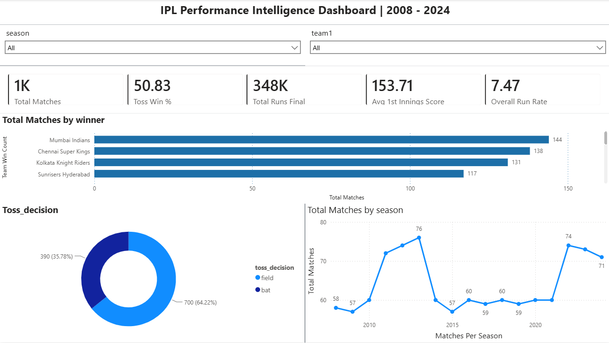
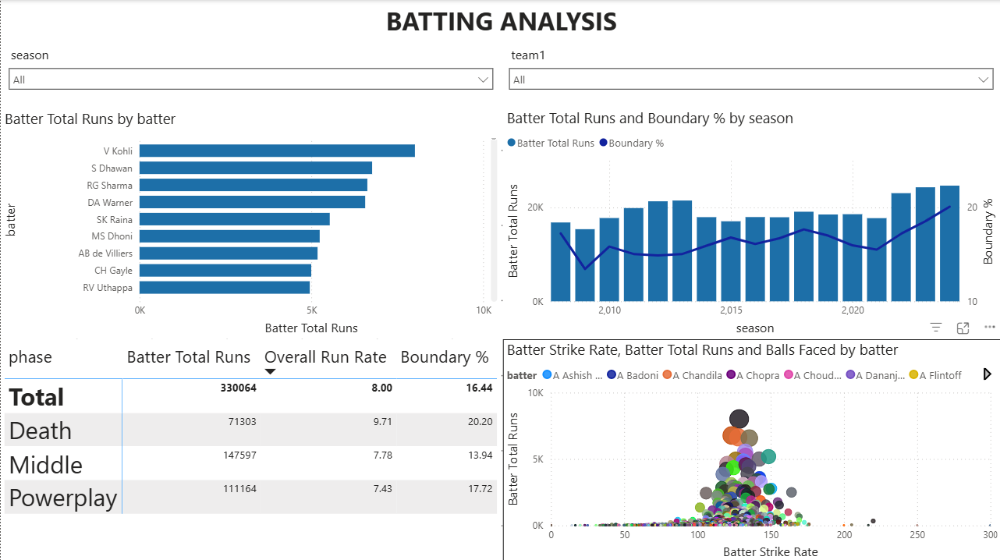
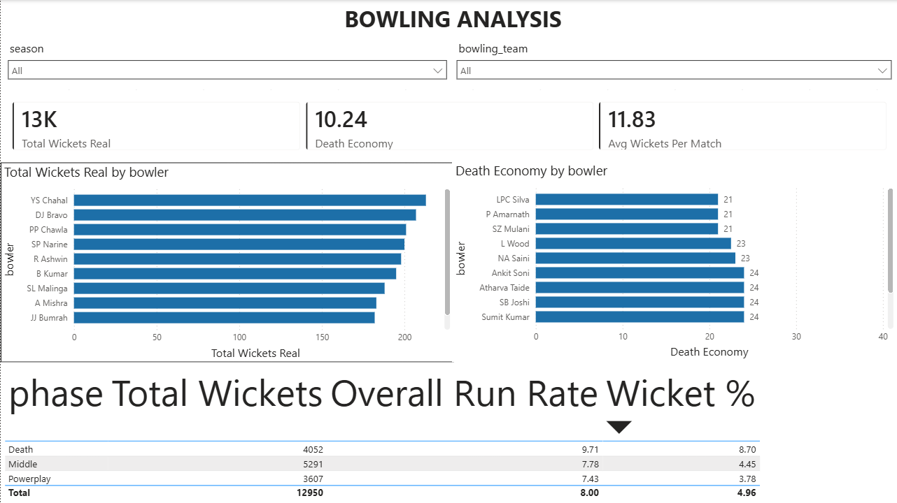

<<<<<<< HEAD

# IPL Performance Intelligence Dashboard | 2008–2024

An end-to-end data analytics project on 17 years of IPL data — covering data cleaning, feature engineering, exploratory data analysis, hypothesis testing, SQL analytics, and a 3-page interactive Power BI dashboard.

---

## Dashboard Snapshots

### Page 1 — Overview


### Page 2 — Batting Analysis


### Page 3 — Bowling Analysis


---

## Problem Statement

This dashboard helps IPL franchise analysts and cricket enthusiasts understand 17 years of IPL performance data. It helps franchises identify which players, teams, and venues perform best across different game phases. Through different performance metrics, they get to know improvement areas for team selection and strategy — and can further work on building squads suited for specific conditions.

Since death overs (16–20) have the highest run rate (9.71) but also the cheapest wickets (runs per wicket = 18.61), franchises must focus on acquiring specialist death-over bowlers with economy below 8.5.

Since toss winners win only ~51% of matches overall, teams must prioritize squad depth over toss strategy.

---

## Dataset

- **Source**: [IPL Complete Dataset — Kaggle](https://www.kaggle.com/datasets/patrickb1912/ipl-complete-dataset-20082020)
- **matches.csv** — ~1,090 rows — match-level data (venue, toss, result, teams, season)
- **deliveries.csv** — ~260,920 rows — ball-by-ball delivery data across all matches

---

## Project Structure

```
ipl-performance-analytics/
│
├── data/                        ← CSVs (raw files downloaded from Kaggle)
├── notebooks/
│   ├── 01_data_cleaning.ipynb
│   ├── 02_feature_engineering.ipynb
│   ├── 03_eda.ipynb
│   ├── 04_hypothesis_testing.ipynb
│   └── 05_load_to_sql.ipynb
├── sql/
│   └── queries.sql
├── powerbi/
│   └── IPL_Performance_Dashboard.pbix
├── screenshots/
│   ├── powerbi_page1_overview.png
│   ├── powerbi_page2_batting.png
│   └── powerbi_page3_bowling.png
└── README.md
```

---

## Steps Followed

- **Step 1** — Loaded `matches.csv` (~1,090 rows) and `deliveries.csv` (~260,920 rows) sourced from Kaggle into Python using Pandas.

- **Step 2** — Data was cleaned and transformed in Python before loading into SQL Server and then Power BI.

- **Step 3** — Inconsistent team names were standardised across all 17 seasons:
  - Delhi Daredevils → Delhi Capitals
  - Kings XI Punjab → Punjab Kings
  - Deccan Chargers → Sunrisers Hyderabad
  - Rising Pune Supergiants → Rising Pune Supergiant

- **Step 4** — Null values were present in `player_dismissed`, `dismissal_kind`, and `fielder` columns — filled with `not_out` and `none` as they represent non-dismissal deliveries.

- **Step 5** — For economy rate calculation, wide and no-ball deliveries were excluded from legal ball count as they do not count as official deliveries bowled.

- **Step 6** — A custom theme was applied in Power BI using primary colour `#1D6FA8`.

- **Step 7** — Five feature engineered columns were created in Python before loading:

  | Column | Description |
  |---|---|
  | `phase` | Classifies each delivery — Powerplay (1–6), Middle (7–15), Death (16–20) |
  | `is_boundary` | 1 if batsman hit a 4 or 6, else 0 |
  | `is_dot_ball` | 1 if delivery resulted in zero runs, else 0 |
  | `is_wicket` | 1 if a wicket fell on that delivery, else 0 |
  | `is_legal` | 1 if legal ball (excludes wides and no-balls), else 0 |

- **Step 8** — Slicers added: `season` and `team1` on Pages 1 & 2; `season` and `bowling_team` on Page 3.

- **Step 9** — Five KPI card visuals added to Page 1:
  - Total Matches
  - Toss Win %
  - Total Runs
  - Avg 1st Innings Score
  - Overall Run Rate

- **Step 10** — Bar chart added to Page 1 showing total wins by team. Mumbai Indians lead with 144 wins, followed by Chennai Super Kings (138).

- **Step 11** — The following DAX measures were created:

  | Measure | Purpose |
  |---|---|
  | Total Matches | Count of matches played |
  | Total Runs | Sum of all runs scored |
  | Total Wickets | Count of all wickets |
  | Overall Run Rate | Runs per over across all deliveries |
  | Boundary % | % of deliveries resulting in 4s or 6s |
  | Toss Win % | % of matches won by toss winner |
  | Avg 1st Innings Score | Average first innings total |
  | Death Economy | Economy rate in overs 16–20 (legal balls only) |
  | Batter Total Runs | Sum of batsman runs |
  | Batter Strike Rate | Runs per 100 balls |
  | Balls Faced | Count of deliveries faced |
  | Total Wickets Real | Wickets excluding not-out deliveries |
  | Avg Wickets Per Match | Average wickets per match |

- **Step 12** — Text box titles added to each page: "IPL Performance Intelligence Dashboard", "BATTING ANALYSIS", "BOWLING ANALYSIS".

- **Step 13** — Chi-Square hypothesis test conducted in Python (SciPy) to test whether toss outcome significantly affects match result. p-value = 0.0088 (< 0.05) confirmed statistical significance but effect size is small — toss explains only ~5% of outcome variance.

- **Step 14** — DAX measure for Death Economy:

  ```
  Death Economy =
  VAR DeathRuns =
      CALCULATE(SUM(deliveries[total_runs]), deliveries[phase] = "Death")
  VAR DeathBalls =
      CALCULATE(
          COUNTROWS(deliveries),
          deliveries[phase] = "Death",
          NOT(deliveries[extras_type] IN {"wides","noballs"})
      )
  RETURN DIVIDE(DeathRuns, DeathBalls / 6, 0)
  ```

- **Step 15** — DAX measure for Total Wickets Real:

  ```
  Total Wickets Real = CALCULATE(
      COUNTROWS(deliveries),
      deliveries[player_dismissed] <> "not_out"
  )
  ```
  Card visual shows **13K** total wickets.

- **Step 16** — DAX measure for Batter Total Runs:

  ```
  Batter Total Runs = SUM(deliveries[batsman_runs])
  ```
  Bar chart shows Top 10 run scorers — V Kohli leads with 8,014 runs.

- **Step 17** — DAX measure for Overall Run Rate:

  ```
  Overall Run Rate = DIVIDE(
      SUM(deliveries[total_runs]),
      COUNTROWS(deliveries) / 6,
      0
  )
  ```
  Card visual shows **7.47**.

- **Step 18** — `.pbix` file saved and included in the `powerbi/` folder for download and local interaction.

---

## SQL Analytics

6 queries written in SQL Server using advanced window functions:

| Query | Window Function Used |
|---|---|
| Top batsman per season | `RANK() OVER (PARTITION BY season)` |
| Season-over-season runs growth | `LAG()` |
| Best death-over bowlers (economy < 8.5) | CTE + HAVING |
| Team win % — bat first vs chase | Conditional aggregation |
| Running total of runs per team per season | `SUM() OVER (PARTITION BY ... ORDER BY ...)` |
| Phase-wise run rate + wicket rate | GROUP BY with computed metrics |

---

## Insights

### [1] Team Performance — 1,090 Matches Analysed

- Mumbai Indians — 144 wins (most successful franchise)
- Chennai Super Kings — 138 wins
- Kolkata Knight Riders — 131 wins
- Sunrisers Hyderabad — 117 wins
- Royal Challengers Bangalore — 116 wins

### [2] Phase-wise Performance

| Phase | Run Rate | Boundary % | Runs per Wicket |
|---|---|---|---|
| Powerplay (1–6) | 7.43 | 17.72% | 32.73 |
| Middle (7–15) | 7.78 | 13.94% | 29.16 |
| Death (16–20) | 9.71 | 20.20% | 18.61 |

Death overs have the highest run rate AND cheapest wickets — making death bowling the highest-leverage skill in T20 cricket.

### [3] Toss Analysis

- Teams fielding first win ~53.9% of matches
- Teams batting first win ~45.4% of matches
- Overall toss winner win rate: 50.83%
- Chi-square p-value = 0.0088 — statistically significant but small effect

### [4] Top Run Scorers

- V Kohli — 8,014 runs (all-time leader, ~1,200 ahead of next)
- S Dhawan — 6,769 runs
- RG Sharma — 6,630 runs
- DA Warner — 6,567 runs (highest overseas scorer)

### [5] Season Trends

- IPL 2013 — highest matches in a single season (76)
- 2022–2024 — consistently highest run totals due to 10-team format
- Boundary % increasing season-on-season — IPL is becoming more batting-friendly

### [6] Bowling Performance

- YS Chahal — all-time leading wicket taker (213 wickets)
- Only 4 bowlers maintain death economy < 8.5 with 20+ overs: Bollinger (7.66), Rashid Khan (7.85), Narine (8.14), Malinga (8.19)
- Leg-spin bowlers dominate the all-time wicket charts

### [7] Toss Decision Split

- 64.22% of toss winners chose to field first
- 35.78% chose to bat first
- Fielding first is the dominant modern IPL toss strategy

---

## Tech Stack

| Tool | Purpose |
|---|---|
| Python (Pandas, NumPy) | Data cleaning & feature engineering |
| Matplotlib, Seaborn | EDA visualizations (8 plots) |
| SciPy | Hypothesis testing (Chi-Square) |
| SQL Server | Data warehouse (5 tables, 6 analytical queries) |
| SQLAlchemy + pyodbc | Python to SQL Server connector |
| Power BI Desktop | 3-page interactive dashboard |
| Git & GitHub | Version control |

---


=======
# ipl-performance-analytics
End-to-end IPL data analytics project — cleaning, EDA, SQL, Power BI, Python | 2008–2024
>>>>>>> f9986560686208c8d9c0b9076d9b5c5a5da71fe0
